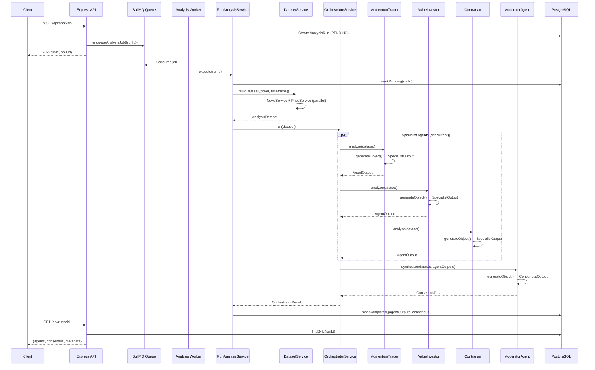

<p align="center">
  <h1 align="center">📈 Sentiment Analysis Server</h1>
  <p align="center">
    An AI-powered multi-agent stock sentiment analysis engine built with Express, Prisma, BullMQ, and Vercel AI SDK.
  </p>
</p>

---

## 🧠 Overview

**Sentiment Server** is a backend system that orchestrates multiple AI agents to perform collaborative stock/asset sentiment analysis. When a user submits a ticker symbol, the system:

1. **Collects market data** — News headlines and price action (with RSI, MACD, SMA) using Finnhub.
2. **Deploys specialized AI agents** — Runs in parallel, each with a distinct investment philosophy (Value Investing, Momentum Trading, Contrarian Strategy) using Google Gemini 2.0 Flash via Vercel AI SDK.
3. **Generates structured outputs** — Agents use `generateObject()` with Zod schemas to return strongly-typed reasoning, risk analysis, and sentiment scores.
4. **Produces a consensus decision** — A Chief Moderator agent synthesizes all specialist outputs, resolves disagreements, and produces a final weighted BUY / SELL / HOLD recommendation with risk management parameters.

All analysis runs are processed asynchronously via a BullMQ job queue backed by Redis, and results are persisted in PostgreSQL via Prisma ORM.

---

## 🏗️ Architecture



---

## 🤖 AI Agents

The orchestrator deploys **four specialized AI agents** utilizing structured generation.

| Agent | Role | Focus |
|-------|------|-------|
| **ValueInvestorAgent** | `value-investor` | Fundamental value, margin of safety, long-term trends |
| **MomentumTraderAgent**| `momentum-trader` | Price action, RSI, MACD, moving average crossovers |
| **ContrarianAgent**    | `contrarian-analyst` | Fading the crowd, challenging consensus, extreme sentiment |
| **ModeratorAgent**     | `moderator-risk-manager`| Resolving disagreements, assigning weights, final consensus, stop-losses |

Each specialist agent produces a **sentiment score** (−1 to +1), **confidence**, **action**, **bull/bear cases**, and **key risks**. The moderator synthesizes these into a final `ConsensusData` object.

---

## 🚀 Getting Started

### Prerequisites

- **Node.js** ≥ 18
- **Docker** & **Docker Compose** (for PostgreSQL and Redis)
- **Google API Key** (for Gemini LLM)
- **Finnhub API Key** (for Market Data)

### 1. Install Dependencies

```bash
npm install
```

### 2. Configure Environment Variables

```bash
cp .env.example .env
```

| Variable | Description |
|----------|-------------|
| `DATABASE_URL` | PostgreSQL connection string |
| `REDIS_URL` | Redis connection string (`redis://localhost:6379`) |
| `GOOGLE_API_KEY` | Google Gemini API key |
| `FINNHUB_API_KEY`| Finnhub API Key |

### 3. Start Infrastructure

```bash
docker run -d --name sentiment-postgres -p 5432:5432 -e POSTGRES_USER=postgres -e POSTGRES_PASSWORD=postgres -e POSTGRES_DB=sentiment_db postgres:16-alpine
docker run -d --name sentiment-redis -p 6379:6379 redis:7-alpine

# Or if docker-compose works for you:
# docker-compose up -d
```

### 4. Database Setup

```bash
npx prisma generate
npx prisma migrate dev
```

### 5. Start the Server & Worker

```bash
# Start the API server
npm run dev

# In a separate terminal, start the background worker
npm run dev:worker
```

---

## 📡 Postman / cURL Commands

You can import these cURL commands directly into Postman by clicking `Import -> Paste Raw Text`.

### 1. Trigger an Analysis
Starts an asynchronous analysis run for a ticker.

```bash
curl -X POST http://localhost:5000/api/analysis \
  -H "Content-Type: application/json" \
  -d '{
    "ticker": "AAPL",
    "timeframe": "30d",
    "includeSocial": true
  }'
```

*Response snippet:*
```json
{
  "runId": "123e4567-e89b-12d3-a456-426614174000",
  "status": "RUNNING",
  "estimatedTime": 45,
  "pollUrl": "/api/runs/123e4567-e89b-12d3-a456-426614174000"
}
```

### 2. Poll for Results
Use the `runId` from the previous request to get the status or final results.

```bash
curl -X GET http://localhost:5000/api/runs/<YOUR_RUN_ID>
```

### 3. List Recent Runs
Get a list of recent analysis runs.

```bash
curl -X GET "http://localhost:5000/api/runs?limit=10&ticker=AAPL"
```

### 4. Get System Stats
Get overall statistics of total runs, completed, failed, and top tickers.

```bash
curl -X GET http://localhost:5000/api/stats
```

### 5. Chatbot
Ask the Gemini model general questions.

```bash
curl -X POST http://localhost:5000/api/chat \
  -H "Content-Type: application/json" \
  -d '{
    "message": "What is the general sentiment around AI stocks currently?"
  }'
```

---

## 🔧 Tech Stack

- **TypeScript** & **Express**
- **Vercel AI SDK** & **Zod**
- **BullMQ** & **Redis**
- **Prisma ORM** & **PostgreSQL**
- **Finnhub**
