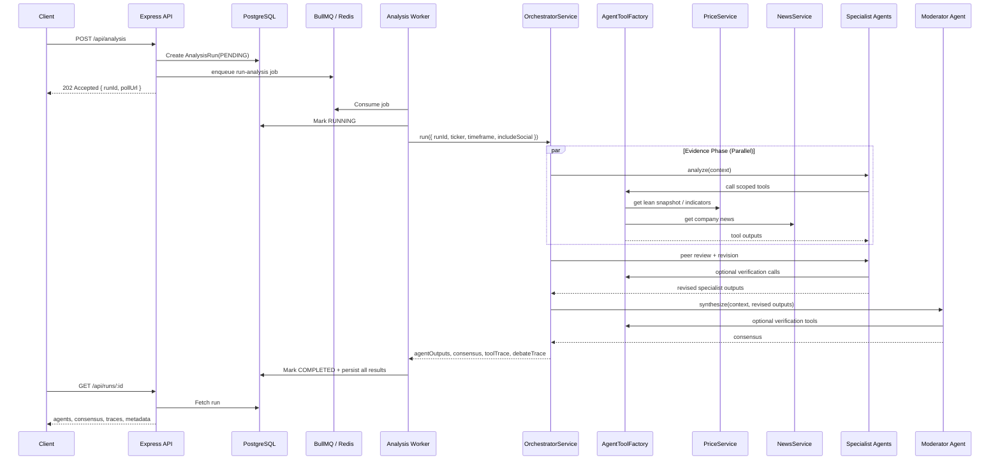
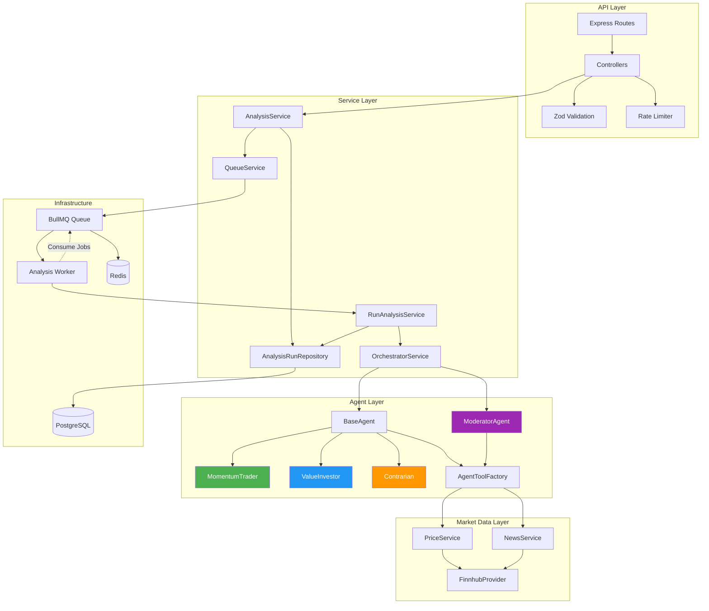
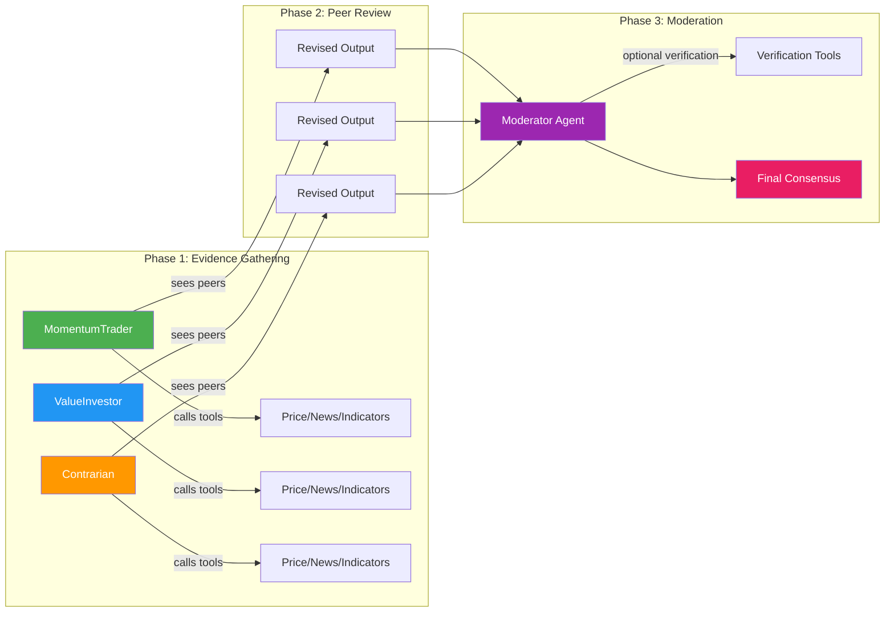
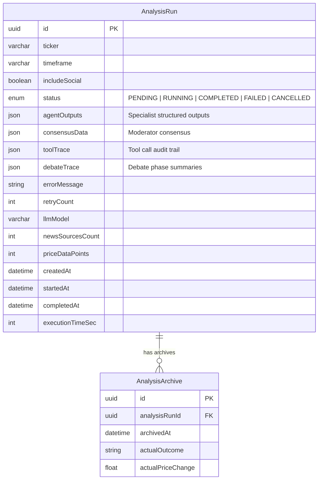

<div align="center">

# 🤖 Multi-Agent Market Sentiment Engine

**Asynchronous, tool-using AI agents that independently gather market evidence, debate each other, and produce auditable BUY / SELL / HOLD recommendations.**

[](https://www.typescriptlang.org/)
[](https://nodejs.org/)
[](https://ai.google.dev/)
[](https://www.postgresql.org/)
[](https://redis.io/)
[](https://docs.bullmq.io/)
[](https://www.prisma.io/)

</div>

---

> **Disclaimer:** This is a software engineering portfolio project demonstrating AI-agent orchestration, not financial advice.

## Table of Contents

- [Overview](#overview)
- [Why This Architecture](#why-this-architecture)
- [System Architecture](#system-architecture)
- [Agent Pipeline Flow](#agent-pipeline-flow)
- [Project Structure](#project-structure)
- [Technical Deep Dive](#technical-deep-dive)
- [Agent Tools](#agent-tools)
- [API Reference](#api-reference)
- [Data Model](#data-model)
- [Getting Started](#getting-started)
- [Testing](#testing)
- [Tech Stack](#tech-stack)

---

## Overview

This backend system orchestrates **three specialist AI agents** — each with a distinct analytical perspective — to analyze stock market sentiment. Rather than stuffing a single LLM prompt with data, each agent autonomously decides which tools to call, gathers its own evidence, and produces a structured thesis. The agents then enter a **peer review round** where they can revise their positions after seeing others' work. Finally, a **moderator agent** synthesizes all perspectives into a weighted consensus with full audit trails.

### Key Engineering Highlights

| Capability | Implementation |
|:---|:---|
| **Multi-Agent Orchestration** | Three specialists run in parallel, then peer-review, then a moderator synthesizes |
| **Tool-Use Architecture** | Agents call scoped tools at runtime — they are _not_ pre-fed data via prompt stuffing |
| **Async Job Processing** | API → BullMQ → Worker separation with immediate 202 responses and polling |
| **Structured Output** | Zod schemas enforce typed, validated JSON from every LLM call via Vercel AI SDK |
| **Full Audit Trail** | Every tool call and debate phase is traced and persisted to the database |
| **Scoped Tool Boundaries** | Agents can only query the ticker/timeframe of their assigned run |
| **Graceful Cancellation** | Cancel runs at queue level or at in-flight checkpoints |
| **Deduplication** | Concurrent requests for the same ticker within 2 minutes are deduplicated |

---

## Why This Architecture

```
Context → LLM → Tool Calls → Evidence → Structured Output    (true agent)
```

1. **Agents receive only run context** — `ticker`, `timeframe`, `includeSocial`, and `runId`
2. **Agents decide which tools to call** — price snapshots, news, or specific indicators
3. **Market data is accessed through backend tools** backed by `PriceService` and `NewsService`
4. **Optional indicators are not automatically included** — agents must explicitly request them via `calculate_indicator`
5. **Specialist agents revise conclusions after seeing peer outputs** — not a single-shot parallel prompt
6. **The moderator can verify claims** with read-only tools before producing consensus
7. **Tool and debate traces are persisted** for full auditability of every decision

---

## System Architecture

### Request Lifecycle



### Component Architecture



---

## Agent Pipeline Flow

The system executes a three-phase pipeline for every analysis run:



| Phase | What Happens | Failure Handling |
|:------|:-------------|:-----------------|
| **Evidence** | 3 specialists run in parallel via `Promise.allSettled()`, each calling tools autonomously | Tolerates 1 failure; aborts if < 2 succeed |
| **Revision** | Each agent sees peer outputs and may revise its position or re-call tools | Falls back to original output on failure |
| **Moderation** | Moderator agent verifies claims, weights specialists, resolves disagreements | Single-agent; failure = run failure |

### The Three Specialists

| Agent | Perspective | Focus |
|:------|:-----------|:------|
| 🟢 **MomentumTrader** | Short-term price action | RSI, MACD, trend continuation/exhaustion, recent candles |
| 🔵 **ValueInvestor** | Fundamental value assessment | Price vs. moving averages, valuation context, news sentiment |
| 🟠 **Contrarian** | Counter-consensus view | Overbought/oversold signals, narrative-vs-data gaps, crowd positioning |

---

## Project Structure

```
server/
├── prisma/
│   ├── schema.prisma                    # Database schema (AnalysisRun, AnalysisArchive)
│   └── migrations/                      # SQL migration history
├── src/
│   ├── server.ts                        # Entry point — HTTP server bootstrap + graceful shutdown
│   ├── app.ts                           # Express app factory (middleware + route mounting)
│   │
│   ├── config/
│   │   ├── env.ts                       # Zod-validated environment config
│   │   ├── db.ts                        # PostgreSQL pool + Prisma client (pg adapter)
│   │   ├── redis.ts                     # Redis singleton (ioredis)
│   │   └── logger.ts                    # Pino structured logger
│   │
│   ├── routes/
│   │   ├── index.ts                     # Central router aggregator
│   │   ├── analysis.routes.ts           # POST /api/analysis (rate-limited, validated)
│   │   ├── runs.routes.ts               # GET/DELETE /api/runs, GET /api/stats
│   │   ├── health.routes.ts             # GET /api/health
│   │   └── chatbot.routes.ts            # POST /api/chat
│   │
│   ├── controllers/
│   │   ├── analysis.controller.ts       # Triggers analysis → 202 Accepted
│   │   ├── runs.controller.ts           # Poll, list, cancel runs + stats
│   │   ├── health.controller.ts         # Health check
│   │   └── chatbot.controller.ts        # Simple Gemini chat endpoint
│   │
│   ├── middleware/
│   │   ├── error.middleware.ts           # Global error handler (ZodError + AppError)
│   │   ├── validate.middleware.ts        # Generic Zod body validation
│   │   ├── rate-limit.middleware.ts      # 10 req/min rate limiter
│   │   ├── request-id.middleware.ts      # UUID per request for log correlation
│   │   └── not-found.middleware.ts       # 404 catch-all
│   │
│   ├── schemas/
│   │   └── analysis.schema.ts           # Zod schemas for API request validation
│   │
│   ├── services/
│   │   ├── analysis/
│   │   │   ├── analysis.service.ts      # Trigger, poll, list, cancel, stats orchestration
│   │   │   ├── run-analysis.service.ts  # Full pipeline executor (called by worker)
│   │   │   ├── queue.service.ts         # BullMQ enqueue/cancel operations
│   │   │   └── polling.service.ts       # Polling logic (placeholder)
│   │   │
│   │   ├── agents/
│   │   │   ├── orchestrator.service.ts  # 3-phase pipeline: evidence → revision → moderation
│   │   │   ├── base/
│   │   │   │   └── base-agent.ts        # Abstract agent with tool loop + structured generation
│   │   │   ├── implementations/
│   │   │   │   ├── momentum-trader.agent.ts
│   │   │   │   ├── value-investor.agent.ts
│   │   │   │   ├── contrarian.agent.ts
│   │   │   │   └── moderator.agent.ts   # Synthesizes consensus from specialist outputs
│   │   │   ├── tools/
│   │   │   │   └── agent-tool.factory.ts # Scoped tool creation with caching + tracing
│   │   │   ├── prompts/                  # System/evidence/revision prompts per agent
│   │   │   ├── parsers/                  # Output parsing + validation (consensus, agent output)
│   │   │   └── schemas/
│   │   │       └── agent.schemas.ts      # Zod schemas for specialist + consensus LLM outputs
│   │   │
│   │   └── market/
│   │       ├── price.service.ts          # Quote, candles, SMA, RSI, MACD, ATR, trend detection
│   │       ├── news.service.ts           # Company news aggregation
│   │       └── dataset.service.ts        # Data aggregator (legacy, pre-agentic)
│   │
│   ├── providers/
│   │   └── finnhub.provider.ts           # HTTP client for Finnhub REST API
│   │
│   ├── repositories/
│   │   ├── analysis-run.repository.ts    # CRUD + state transitions for AnalysisRun
│   │   └── analysis-archive.repository.ts
│   │
│   ├── jobs/
│   │   ├── workers/
│   │   │   └── analysis.worker.ts        # Standalone BullMQ worker process
│   │   └── processors/
│   │       └── run-analysis.processor.ts # Delegates to RunAnalysisService
│   │
│   ├── lib/
│   │   ├── errors/
│   │   │   └── app-error.ts              # Custom error class with HTTP status codes
│   │   └── utils/
│   │       └── time.ts                   # Time calculation helpers
│   │
│   ├── types/
│   │   ├── analysis.types.ts             # Core domain types (AgentOutput, ConsensusData, etc.)
│   │   ├── price.types.ts                # PriceSnapshot, DerivedFeatures, IndicatorResult
│   │   ├── finnhub.types.ts              # Finnhub API response types
│   │   ├── finnhub.d.ts                  # Module declarations
│   │   └── api.types.ts                  # Express request extension types
│   │
│   └── tests/
│       ├── integration/
│       │   └── health.test.ts            # Health route integration test
│       └── unit/
│           ├── orchestrator-agentic-flow.test.ts  # Evidence → revision → moderation flow
│           ├── agent-tool-factory.test.ts          # Scoped tool boundaries + caching
│           ├── consensus-parser.test.ts            # Consensus Zod validation
│           └── price-service-tools.test.ts         # Lean snapshot + indicator calculation
│
├── docker-compose.yml                    # PostgreSQL 16 + Redis 7 containers
├── prisma.config.ts                      # Prisma datasource configuration
├── tsconfig.json                         # TypeScript strict config (ES2022, NodeNext)
├── package.json
├── .env.example                          # Environment variable template
└── .gitignore
```

---

## Technical Deep Dive

### BaseAgent — Abstract Agent Framework

Every specialist extends `BaseAgent<TOutput>`, which provides a two-stage execution model:

```
┌─────────────────────────────────┐
│  1. Tool Loop (generateText)    │  ← Agent calls tools, builds evidence notes
│     - System prompt + context   │
│     - Up to 5 tool call steps   │
│     - Returns free-text notes   │
├─────────────────────────────────┤
│  2. Finalization (generateObject)│  ← Converts notes → typed Zod-validated output
│     - Evidence notes + traces   │
│     - Strict schema enforcement │
│     - Low temperature (0.2)     │
└─────────────────────────────────┘
```

Subclasses only define three things:
- `identity` — agent name and role
- `outputSchema` — Zod schema for structured output
- `buildPromptContext()` — system, evidence, and revision prompts

### AgentToolFactory — Scoped Tool Management

The `AgentToolFactory` enforces **tool scoping** and provides **per-run caching**:

- **Scope enforcement**: If an agent tries to query a ticker or timeframe different from the run context, the tool throws an error
- **Result caching**: Identical tool calls across agents share cached `Promise` instances — no duplicate API calls
- **Auto-tracing**: Every tool execution is recorded to the trace array with agent name, inputs, output summary, and timestamp
- **Separate tool sets**: Specialists get 3 tools; the moderator gets 2 (read-only, no indicator calculation)

### Structured Output via Vercel AI SDK

All LLM outputs are validated at generation time using `generateObject()` with Zod schemas:

```typescript
// Specialist output — enforced by the LLM
{
  action: "BUY" | "SELL" | "HOLD",
  score: -1 to 1,         // sentiment score
  confidence: 0 to 100,   // confidence percentage
  reasoning: string,       // multi-sentence explanation
  bullCase: string,
  bearCase: string,
  keyRisks: string[],      // 1-5 risks
  keyData: string          // key data points used
}

// Consensus output — produced by moderator
{
  action, score, confidence,
  allocation: 0-30,         // portfolio allocation %
  riskLevel: "LOW" | "MODERATE" | "HIGH",
  stopLoss: number | null,
  takeProfit: number | null,
  timeHorizon: string,
  keyRisks: string[],
  analystWeightsUsed: { MomentumTrader: 0.34, ... },
  disagreements: string[]
}
```

---

## Agent Tools

### Specialist Tools

| Tool | Description | Input |
|:-----|:-----------|:------|
| `get_price_snapshot` | Lean price context: quote, 5 recent candles, SMA10, SMA30, data availability | `{ ticker, timeframe? }` |
| `get_company_news` | Recent company news articles (when `includeSocial` is enabled) | `{ ticker }` |
| `calculate_indicator` | One optional indicator per call: `rsi14`, `macd`, `atrPercent`, or `trend` | `{ ticker, indicator }` |

### Moderator Tools

| Tool | Description |
|:-----|:-----------|
| `get_price_snapshot` | Verify price claims from specialists |
| `get_company_news` | Verify news/narrative claims |

> Tools are scoped to the current run. If an agent tries to query another ticker or timeframe, the tool rejects the call with an error.

---

## API Reference

**Base URL:** `http://localhost:5000/api`

### Health Check

```http
GET /api/health
```

### Trigger Analysis

```http
POST /api/analysis
Content-Type: application/json

{
  "ticker": "AAPL",
  "timeframe": "30d",       // 1d | 5d | 7d | 30d | 90d | 1y | 2y | 5y
  "includeSocial": true
}
```

**Response** `202 Accepted`:

```json
{
  "runId": "123e4567-e89b-12d3-a456-426614174000",
  "status": "RUNNING",
  "estimatedTime": 45,
  "pollUrl": "/api/runs/123e4567-e89b-12d3-a456-426614174000"
}
```

### Poll Run Status

```http
GET /api/runs/:id
```

**Response** (when completed):

```json
{
  "runId": "...",
  "ticker": "AAPL",
  "timeframe": "30d",
  "status": "COMPLETED",
  "agents": [
    {
      "name": "MomentumTrader",
      "action": "BUY",
      "score": 0.6,
      "confidence": 72,
      "reasoning": "...",
      "evidence": [{ "toolName": "get_price_snapshot", "summary": "..." }]
    }
  ],
  "consensus": {
    "action": "BUY",
    "score": 0.45,
    "confidence": 65,
    "allocation": 12,
    "riskLevel": "MODERATE",
    "reasoning": "...",
    "analystWeightsUsed": { "MomentumTrader": 0.34, "ValueInvestor": 0.33, "Contrarian": 0.33 },
    "disagreements": ["Contrarian disagreed on trend sustainability"]
  },
  "traces": {
    "toolTrace": [{ "agentName": "MomentumTrader", "toolName": "get_price_snapshot", "..." }],
    "debateTrace": [{ "agentName": "Contrarian", "phase": "revision", "..." }]
  },
  "metadata": {
    "llmModel": "gemini-2.0-flash",
    "executionTimeSec": 44,
    "retryCount": 0,
    "newsSourcesCount": 5,
    "priceDataPoints": 10
  }
}
```

### List Runs

```http
GET /api/runs?limit=10&ticker=AAPL&status=COMPLETED
```

### Cancel Run

```http
DELETE /api/runs/:id
```

Removes queued jobs when possible. If already active, the worker stops at the next cancellation checkpoint.

### Stats

```http
GET /api/stats
```

Returns `totalRuns`, `completedRuns`, `failedRuns`, `pendingRuns`, `topTickers`, `runsLast24h`.

### Chat (Standalone)

```http
POST /api/chat
Content-Type: application/json

{ "message": "What is market sentiment?" }
```

> The chat endpoint is a standalone Gemini integration, separate from the agentic pipeline.

---

## Data Model



### Trace Schemas

**Tool Trace** — records every tool call across all agents:

```json
{
  "agentName": "MomentumTrader",
  "toolName": "get_price_snapshot",
  "input": { "ticker": "AAPL", "timeframe": "30d" },
  "outputSummary": "Price 190, 10 recent candles, SMA10 185, SMA30 180.",
  "calledAt": "2026-05-12T09:00:00.000Z"
}
```

**Debate Trace** — records each phase per agent:

```json
{
  "agentName": "Contrarian",
  "phase": "revision",
  "summary": "Reduced confidence after peer review because news evidence did not support an extreme sentiment claim.",
  "createdAt": "2026-05-12T09:00:00.000Z"
}
```

---

## Getting Started

### Prerequisites

- **Node.js** ≥ 18
- **Docker** & **Docker Compose** (for PostgreSQL + Redis)
- **Google Gemini API key** ([Get one here](https://aistudio.google.com/apikey))
- **Finnhub API key** ([Get one here](https://finnhub.io/register))

### 1. Clone & Install

```bash
git clone https://github.com/Ravi8043/orchestration_agents.git
cd orchestration_agents
npm install
```

### 2. Configure Environment

```bash
cp .env.example .env
```

Edit `.env` with your keys:

| Variable | Required | Description |
|:---------|:--------:|:------------|
| `DATABASE_URL` | ✅ | PostgreSQL connection string |
| `REDIS_URL` | ✅ | Redis connection string |
| `GOOGLE_API_KEY` | ✅ | Google Gemini API key |
| `FINNHUB_API_KEY` | ✅ | Finnhub market data API key |
| `LLM_MODEL` | — | Model name stored in run metadata (default: `gemini-2.0-flash`) |
| `ANALYSIS_RETRY_ATTEMPTS` | — | BullMQ retry attempts (default: `2`) |
| `ANALYSIS_BACKOFF_MS` | — | Retry backoff delay (default: `30000`) |

### 3. Start Infrastructure

```bash
docker-compose up -d
```

This starts:
- **PostgreSQL 16** on port `5432`
- **Redis 7** on port `6379`

### 4. Database Setup

```bash
npm run prisma:generate
npm run prisma:migrate
```

### 5. Start the System

You need **two terminal windows**:

```bash
# Terminal 1 — API Server
npm run dev

# Terminal 2 — Analysis Worker
npm run dev:worker
```

### 6. Test It

```bash
# Trigger an analysis
curl -X POST http://localhost:5000/api/analysis \
  -H "Content-Type: application/json" \
  -d '{"ticker": "AAPL", "timeframe": "30d", "includeSocial": true}'

# Poll the result (replace <RUN_ID> with the returned runId)
curl http://localhost:5000/api/runs/<RUN_ID>
```

---

## Testing

```bash
npm run build
npm test
```

### Test Coverage

| Test | Type | What It Validates |
|:-----|:-----|:------------------|
| `health.test.ts` | Integration | Health route returns 200 |
| `orchestrator-agentic-flow.test.ts` | Unit | Full evidence → revision → moderation pipeline with mocked agents |
| `agent-tool-factory.test.ts` | Unit | Scoped tool boundaries, ticker/timeframe enforcement |
| `consensus-parser.test.ts` | Unit | Zod validation for moderator consensus output |
| `price-service-tools.test.ts` | Unit | Lean snapshot generation + indicator calculations |

---

## Available Scripts

| Script | Purpose |
|:-------|:--------|
| `npm run dev` | Start API server in watch mode (tsx) |
| `npm run dev:worker` | Start analysis worker in watch mode |
| `npm run build` | Compile TypeScript to `dist/` |
| `npm run start` | Run compiled API server |
| `npm run start:worker` | Run compiled worker |
| `npm run lint` | Type-check without emitting files |
| `npm test` | Run full Vitest test suite |
| `npm run prisma:generate` | Generate Prisma client |
| `npm run prisma:migrate` | Run database migrations |
| `npm run prisma:studio` | Open Prisma Studio GUI |

---

## Tech Stack

| Layer | Technology | Purpose |
|:------|:-----------|:--------|
| **Runtime** | Node.js 18+, TypeScript 5.9 | Strict type safety with ES2022 target |
| **Framework** | Express 4 | HTTP routing, middleware pipeline |
| **AI** | Vercel AI SDK + Google Gemini 2.0 Flash | Structured generation (`generateObject`), tool loops (`generateText`) |
| **Database** | PostgreSQL 16, Prisma ORM | Persistent storage with pg adapter for connection pooling |
| **Queue** | BullMQ + Redis 7 | Reliable async job processing with retries and backoff |
| **Validation** | Zod | Request validation, environment config, LLM output schemas |
| **Logging** | Pino + pino-http | Structured JSON logging with request ID correlation |
| **Market Data** | Finnhub API | Real-time quotes, historical candles, company news |
| **Testing** | Vitest + Supertest | Unit and integration testing |
| **Containerization** | Docker Compose | Local infrastructure (Postgres + Redis) |

---

<div align="center">

Built as a backend AI systems portfolio project — focusing on **agent orchestration**, **tool boundaries**, **typed outputs**, and **auditability** over UI polish.

</div>
