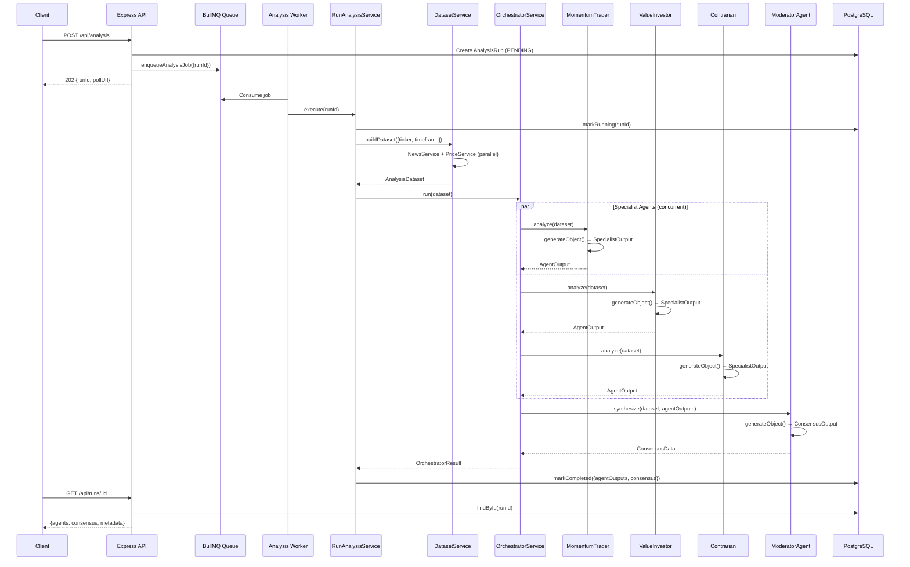

# Multi-Agent Orchestration System — Architecture Walkthrough

## ✅ Build Status: All TypeScript compiles with zero errors

---

## System Flow (End-to-End)



---

## Files Created / Modified

### Created (New)
| File | Purpose |
|------|---------|
| [agent.schemas.ts](file:///c:/Users/racha/Desktop/server/src/services/agents/schemas/agent.schemas.ts) | Zod schemas for `generateObject()` — `specialistOutputSchema` and `consensusOutputSchema` |
| [dataset.service.ts](file:///c:/Users/racha/Desktop/server/src/services/market/dataset.service.ts) | Aggregates NewsService + PriceService into a single `AnalysisDataset` |
| [moderator.prompt.ts](file:///c:/Users/racha/Desktop/server/src/services/agents/prompts/moderator.prompt.ts) | Moderator system/user prompts that receive all specialist outputs |

### Rewritten (Major Changes)
| File | What Changed |
|------|-------------|
| [base-agent.ts](file:///c:/Users/racha/Desktop/server/src/services/agents/base/base-agent.ts) | From simple function → abstract class with `generateObject()`, logging, retries |
| [momentum-trader.agent.ts](file:///c:/Users/racha/Desktop/server/src/services/agents/implementations/momentum-trader.agent.ts) | From empty → full `BaseAgent<SpecialistOutput>` implementation |
| [value-investor.agent.ts](file:///c:/Users/racha/Desktop/server/src/services/agents/implementations/value-investor.agent.ts) | From empty → full `BaseAgent<SpecialistOutput>` implementation |
| [contrarian.agent.ts](file:///c:/Users/racha/Desktop/server/src/services/agents/implementations/contrarian.agent.ts) | From empty → full `BaseAgent<SpecialistOutput>` implementation |
| [moderator.agent.ts](file:///c:/Users/racha/Desktop/server/src/services/agents/implementations/moderator.agent.ts) | From empty → full `BaseAgent<ConsensusOutput>` with `synthesize()` |
| [orchestrator.service.ts](file:///c:/Users/racha/Desktop/server/src/services/agents/orchestrator.service.ts) | From empty → workflow coordinator with concurrent agents + moderator |
| [run-analysis.service.ts](file:///c:/Users/racha/Desktop/server/src/services/analysis/run-analysis.service.ts) | From commented-out → fully wired pipeline with DatasetService |
| [momentum-trader.prompt.ts](file:///c:/Users/racha/Desktop/server/src/services/agents/prompts/momentum-trader.prompt.ts) | From ticker-only → dataset-aware with full technical data |
| [value-investor.prompt.ts](file:///c:/Users/racha/Desktop/server/src/services/agents/prompts/value-investor.prompt.ts) | From ticker-only → dataset-aware with valuation context |
| [contrarian.prompt.ts](file:///c:/Users/racha/Desktop/server/src/services/agents/prompts/contrarian.prompt.ts) | From ticker-only → dataset-aware with narrative detection |

### Updated (Aligned)
| File | What Changed |
|------|-------------|
| [analysis.types.ts](file:///c:/Users/racha/Desktop/server/src/types/analysis.types.ts) | Added `OrchestratorResult`, extended `AnalysisDataset.priceData` with full snapshot/candles/features, aligned `AgentOutput` & `ConsensusData` |
| [agent-output.parser.ts](file:///c:/Users/racha/Desktop/server/src/services/agents/parsers/agent-output.parser.ts) | Added `action` and `keyRisks` fields |
| [consensus.parser.ts](file:///c:/Users/racha/Desktop/server/src/services/agents/parsers/consensus.parser.ts) | Added `disagreements` field |
| [agent-types.parser.ts](file:///c:/Users/racha/Desktop/server/src/services/agents/parsers/agent-types.parser.ts) | Re-exports canonical types, removed duplicates |

### Deprecated
| File | Reason |
|------|--------|
| [debate-moderator.prompt.ts](file:///c:/Users/racha/Desktop/server/src/services/agents/prompts/debate-moderator.prompt.ts) | Superseded by unified `moderator.prompt.ts` |
| [chief-risk-manager.prompt.ts](file:///c:/Users/racha/Desktop/server/src/services/agents/prompts/chief-risk-manager.prompt.ts) | Risk management merged into ModeratorAgent |

### Untouched (Preserved)
All of: `app.ts`, `server.ts`, `analysis.service.ts`, `queue.service.ts`, `analysis.worker.ts`, `run-analysis.processor.ts`, all controllers, routes, middleware, config, providers, repositories, and the Prisma schema.

---

## Agent Architecture

```
BaseAgent<TOutput>  (abstract)
├── identity: AgentIdentity
├── outputSchema: ZodType<TOutput>
├── buildContext(): AgentRunContext
└── generate(): Promise<TOutput>  (uses Vercel AI SDK generateObject)

  ┌──────────────────────────┐
  │   MomentumTraderAgent    │ → BaseAgent<SpecialistOutput>
  │   ValueInvestorAgent     │ → BaseAgent<SpecialistOutput>
  │   ContrarianAgent        │ → BaseAgent<SpecialistOutput>
  └──────────────────────────┘
           │
           │  AgentOutput[]
           ▼
  ┌──────────────────────────┐
  │   ModeratorAgent         │ → BaseAgent<ConsensusOutput>
  │   .synthesize(dataset,   │
  │     agentOutputs)        │
  └──────────────────────────┘
           │
           │  ConsensusData
           ▼
       Persistence
```

---

## Key Design Decisions

1. **`generateObject()` over `generateText()`** — All agents use structured output generation. The LLM is forced to conform to Zod schemas, eliminating parsing failures.

2. **`Promise.allSettled()` for specialists** — If one agent fails, the others still succeed. The orchestrator requires ≥2 of 3 specialists to proceed, providing graceful degradation.

3. **DatasetService as single data-acquisition layer** — Agents never call raw APIs. The dataset is built once and shared with all agents, ensuring consistency and avoiding redundant API calls.

4. **Prompts include real data** — Every prompt is constructed with actual price snapshots, technical indicators, and news headlines from the dataset. No simulated data.

5. **Separation of concerns preserved** — Orchestrator does NO reasoning. Agents do NO data fetching. Repository does NO business logic. Worker does NO orchestration.

6. **Future extensibility** — Adding a new specialist agent requires: (a) a new prompt file, (b) a new class extending `BaseAgent<SpecialistOutput>`, (c) one line in `OrchestratorService.run()`. No other changes needed.
